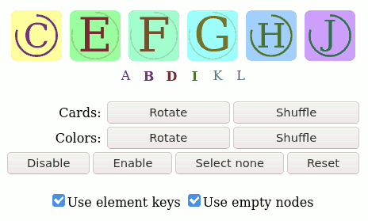
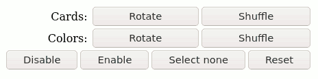
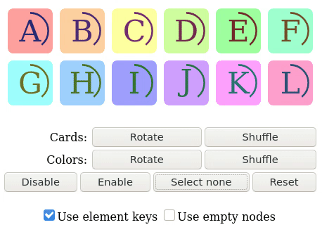
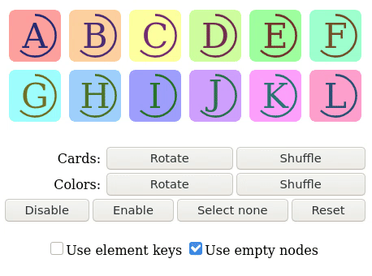
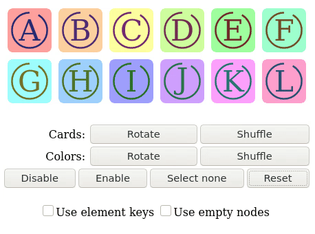
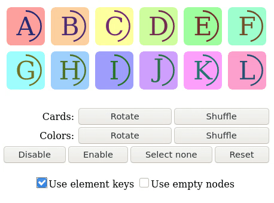
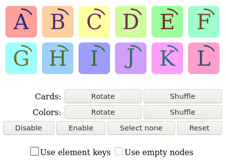
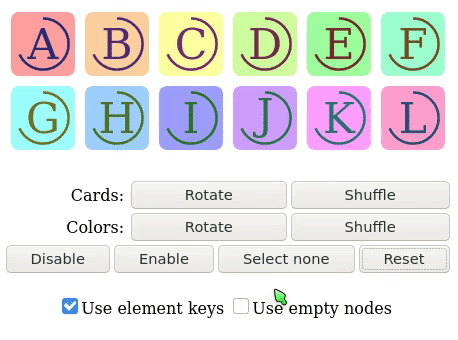

## Element key example

This example shows how to control a DOM update using element keys and empty nodes.

<!-- hidden sections will not appear in the aplication -->
<!-- hidden begin -->

<!-- hidden end -->

### Page sections
#### Card table

At the top you can see color cards with letters. Below them, in the form of smaller letters, are disabled cards.


To select a card, click on it with the mouse button.
You can also change the order of the enabled cards by dragging them with the mouse.

Upon appearance or replacement, the outline of the card is highlighted in red.
If the card is updated in-place, then you will see a smooth transition between the old and new colors.
So you can distinguish which cards were replaced, and which were updated in-place.

The rotating circle inside the card shows the time since the appearance or replacement of this card.

#### Control buttons

Next you can see the control buttons.



So you can rotate the cards or their colors, shuffle the cards or their colors, enable and disable the cards, deselect all cards and reset the state.

Rotating cards or colors shifts cards or colors by one so that the last card or color becomes the first.

Shuffling reorders cards or colors at random.

Rotation and shuffling is applied to the selected and enabled cards, or to all enabled if no cards are selected.
Enabling and disabling apply to selected cards.

#### Options

And finally, two options to switch element keys and empty nodes.


### Enabling and disabling elements

An example shows how the elements behave when they appear and disappear.

 1. Make sure that the options are set as described below.
 2. Select a few cards in the middle, for example: `C`&nbsp;`D`&nbsp;`I`&nbsp;`J`.
 3. Press `Disable` and `Enable` buttons in turn.

#### With element keys

`Use element keys` is checked, `Use empty nodes` does not affect the result.

The correspondence between old and new elements is determined using keys.



Note that only the cards that appear are highlighted, and all other cards stay unchanged.

#### With empty nodes

`Use element keys` is unchecked, `Use empty nodes` is checked.

Empty nodes are used as a placeholders for disabled elements. This allows to maintain the correspondence between old and new elements.



Result must be same as with element keys.

#### Without element keys an empty noedes

Both `Use element keys` and `Use empty nodes` is unchecked.

All elements with same tag and namespace are updated in-place. 

If there are fewer old elements than new ones, then the elements are added to the end.
If there are more old elements than new ones, then the elements are removed from the end.



Note the color transition of the cards, these cards are updated in-place.

### Reordering elements

An example shows how the elements behave when their order changes.

 1. Make sure that the options are set as described below.
 2. Select a few cards in the middle, for example: `B`&nbsp;`C`&nbsp;`D`&nbsp;`E`.
 3. Press `Rotate` or `Shuffle` button to the right of the `Cards:`.

#### With element keys

`Use element keys` is checked, `Use empty nodes` does not affect the result.

The correspondence between old and new elements is determined using keys.



Note that some of the cards are highlighted in red, while the rest remain unchanged.
In the case of rotation, only the first card is highlighted in red.

#### Without element keys

`Use element keys` is unchecked, `Use empty nodes` does not affect the result.

Application cannot determine the correspondence between old and new elements and all elements are updated in-place.



Note the color transition of the cards. None of cards are highlighted in red.

### Color reordering

This example shows what happens when the attributes of the elements change but the order remains the same.

Both `Use element keys` and `Use empty nodes` does not affect the result.

 1. Select a few cards in the middle, for example: `B`&nbsp;`C`&nbsp;`D`&nbsp;`E`.
 2. Press `Rotate` or `Shuffle` button to the right of the `Colors:`.

All elements are updated in-place.



Note the color transition of the cards. None of cards are highlighted in red.

<!-- hidden begin -->

---

```bash
cargo make start
```

Open [127.0.0.1:8000](http://127.0.0.1:8000) in your browser.
<!-- hidden end -->
